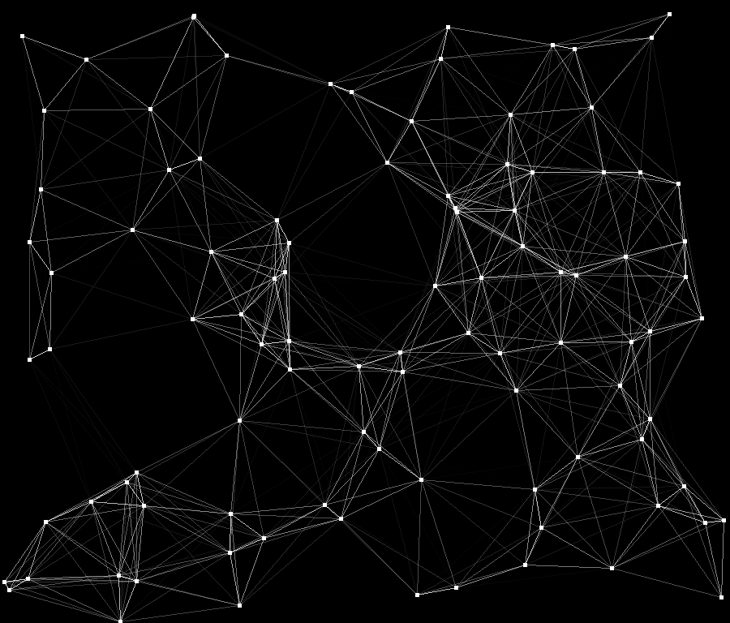

# cl-simple-animation-demo

## About
Generate points with random positions and velocities. Draw lines between points
that are close together, where the further the points are, the more transparent the
line.
## Quick start (assumes [quicklisp](https://www.quicklisp.org/beta/) is installed)
 - Clone repository (ideally into a place [ASDF can find](https://asdf.common-lisp.dev/asdf/Configuring-ASDF-to-find-your-systems.html))
   ```
   git clone https://github.com/tobyWorland/cl-simple-animation-demo.git
   ```
 - Open a lisp repl and load the `animation` system
   ```
   (handler-case (ql:quickload :animation)
     (quicklisp-client:system-not-found (c)
       (declare (ignore c))
         ;; Assumes current directory is this repository
         (push (first (directory ".")) asdf:*central-registry*)
         (ql:quickload :animation)))
   ```
 - Start animation
   ```
   (animation:run)
   ```
